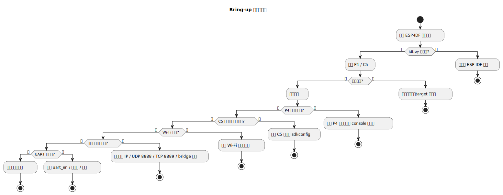

# 04 常见问题排查

适合谁看：
- 编译、烧录、启动或联调过程中卡住的人
- 想知道出现问题时先查哪里的人

读完会得到什么：
- 知道常见失败点是什么
- 知道推荐的排查顺序
- 知道问题更可能在 P4、C5 还是联动边界

## 排查时最重要的一条规则

一次只确认一个层级。不要在“环境没准备好”的时候去怀疑桥接逻辑，也不要在“控制台没起来”的时候去追网络包。

## 最常见的四类问题

### 1. 构建工具不可用

现象：

- `idf.py` 找不到
- 目标芯片没有正确设置

先查：

- ESP-IDF 环境是否已经加载
- 当前终端是否继承了工具链环境

### 2. 设备能烧录，但启动不正常

现象：

- 没有进入预期日志
- P4 没有控制台
- C5 没有进入协处理器固件启动逻辑

先查：

- 是否烧到了正确的目标板
- 是否用了错误的 `sdkconfig`
- 是否在 C5 端破坏了 no-PSRAM 或 SDIO 相关配置

### 3. P4 控制台可用，但网络不工作

现象：

- `wifi_set` 失败
- `net_start` 失败
- `net_localip` 没拿到地址

先查：

- Wi-Fi 是否连上
- `net_type` 是否先设置
- 当前模式是 client 还是 server
- 目标 IP 和端口是否合理

### 4. 网络正常，但飞控链路不通

现象：

- 网络收到了数据
- 但是 UART 侧没有看到转发结果

先查：

- `uart_en` 是否已打开
- 波特率是否匹配
- 实际使用的是哪一路 UART
- 发送的数据是否真的是预期帧格式

## 推荐排查顺序

先看文字说明，再看下面这张流程图。

推荐顺序：

1. 工具链是否可用
2. 能否编译
3. 能否烧录
4. P4 是否启动控制台
5. C5 是否启动协处理器逻辑
6. Wi-Fi 是否连通
7. 网络是否启动
8. UART 是否打开
9. 端到端消息是否通过

## 快速定位建议

| 现象 | 优先看哪里 |
| --- | --- |
| 控制台命令不存在 | `p4-firmware/main/console_app.c`、`network_cmd.c`、`bridge_cmd.c` |
| 网络设置无效 | `p4-firmware/main/network_app.cpp`、`network_cmd.c` |
| UART 无转发 | `p4-firmware/main/mavlink_bridge.cpp`、`bridge_cmd.c` |
| C5 启动配置异常 | `c5-firmware/main/esp_hosted_coprocessor.c`、`sdkconfig` |

## 什么时候该回头补文档

如果你排查时发现自己必须读很多源码才能知道下一步查什么，这通常说明文档还不够。把你这次排查依赖的关键线索补回文档，能让下一个人少走很多弯路。
