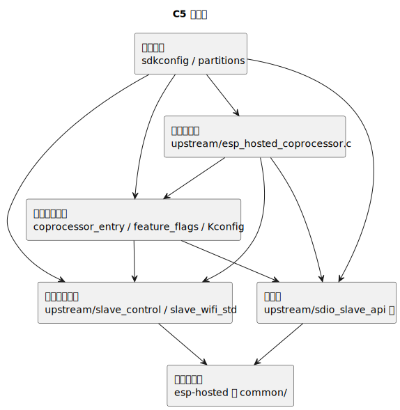

# C5 固件架构

适合谁看：
- 准备修改 C5 侧无线协处理器逻辑的人
- 想知道 `esp-hosted` 定制层和项目自定义边界的人

读完会得到什么：
- 知道 C5 在整个系统里的角色
- 知道应该把哪些内容视为上游基础层，哪些内容视为项目定制层
- 知道改 C5 时最容易踩的限制是什么

## C5 在系统里扮演什么角色

C5 不是这个项目里负责上层桥接行为的主角。它更像“给 P4 提供无线能力的专用协处理器”。

这里的协处理器，意思是它不负责上位机业务流程，而是负责把 Wi-Fi 和相关传输能力稳定地提供给主控侧。

## 为什么理解 C5 要先看分层

P4 代码更像一个从头组织起来的应用。C5 不一样。C5 是在上游 `esp-hosted` 框架基础上做定制，所以你先要知道哪些是基础层，哪些是项目层。

看图之前先记住这四层：

- 上游 `esp-hosted` 基础能力
- 本项目的定制配置层
- 传输层
- Wi-Fi 与控制能力层

## 关键入口

C5 入口在 `firmware-c5/main/esp_hosted_coprocessor.c`。这个入口负责启动协处理器主流程，并组织传输、能力声明和控制逻辑。

除此以外，常见关注点还有：

- `slave_control.*`
- `sdio_slave_api.*`
- `slave_wifi_std.*`
- `sdkconfig`

## 这侧最重要的限制

当前仓库的 C5 工程不是“随便改配置都能活”的状态。它明显依赖几项约束：

- 目标芯片是 ESP32-C5
- 传输方式要保持 SDIO 相关配置
- 内存约束要符合 no-PSRAM 环境

所以改 C5 时最常见的风险不是“语法错了”，而是“配置漂了”。

## 读这侧代码时的建议顺序

1. 先看入口文件，理解系统怎么起来
2. 再看传输和控制相关模块
3. 最后再看 Wi-Fi 细节和上游依赖

如果你一开始就扎进 `managed_components/`，通常会过早进入上游细节，反而看不出项目自己的定制边界。
