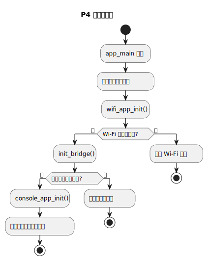
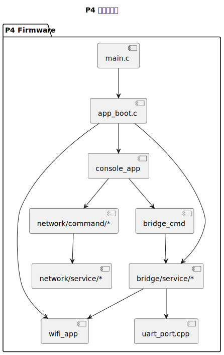

# P4 固件架构

适合谁看：
- 准备修改 P4 侧逻辑的人
- 想知道控制台、网络和桥接模块如何关联的人

读完会得到什么：
- 知道 P4 的启动入口是什么
- 知道主要模块各自负责什么
- 知道哪个模块更适合承接哪类改动

## P4 先做什么

P4 是主控侧固件。它负责把网络配置、网络收发、UART 转发和控制台命令组织到一起。

从 `app_main` 开始，当前代码的初始化顺序很明确。`main.c` 只保留最薄的一层入口，真正的启动编排落在 `app/service/app_boot.c`：

1. 初始化 Wi-Fi
2. 初始化桥接器，并拉起主 MAVLink 网络监听
3. 初始化控制台

上面这个顺序在代码里对应 `firmware-p4/main/main.c`。在真正改代码之前，先知道它不是“控制台驱动整个系统”，而是“控制台在系统起来后提供配置入口”。

## P4 主要模块

| 模块 | 作用 | 什么时候去看它 |
| --- | --- | --- |
| `main.c` + `app/service/app_boot.c` | 启动顺序、Wi-Fi/桥接/控制台编排 | 想看系统怎么起来 |
| `wifi_app` | Wi-Fi 连接管理 | Wi-Fi 连接失败或配网行为变了 |
| `bridge/service/*` | 主 MAVLink 桥接逻辑、默认 UDP/TCP 监听、统计与 UART 转发 | 端到端消息转发、默认端口、帧处理 |
| `bridge/adapter/mavlink_parser.*` | MAVLink 帧识别与序列信息提取 | 想确认帧格式和日志判断逻辑 |
| `bridge_cmd` | UART 命令解析 | `uart_*` 命令行为 |
| `console_app` | 控制台初始化与命令注册 | 控制台入口、命令是否注册成功 |
| `network/command/*` + `network/service/*` | 独立的 `net_*` 调试网络通道 | 想看 `net_*` 命令本身，不是主桥接链路 |

## 模块之间怎么依赖

先理解一件事：P4 的模块不是平铺并列的。`main.c` / `app_boot.c` 是启动入口，`console_app` 是人机交互入口，`bridge/service/*` 是真正承载主链路行为的核心。

下面这张图用依赖关系把它们串起来。

## 读代码时怎么切入

### 想改命令

先看 `console_app`，确认命令在哪里注册。再看 `network/command/*` 或 `bridge_cmd`，确认参数怎么解析，最后再落到业务模块。

### 想改网络行为

先区分你改的是哪一条网络路径：

- 如果你改的是主 MAVLink 桥接链路，先看 `app/service/app_boot.c` 和 `bridge/service/bridge_network_runtime.cpp`
- 如果你改的是 `net_*` 命令对应的独立调试通道，再看 `network/service/*` 和 `network/command/*`

### 想改 UART 或桥接行为

先看 `bridge/service/*`。这里是 P4 侧最核心的“消息从哪来，到哪去”的位置。

## 最容易改乱的地方

- 把“命令层”和“业务层”逻辑混在一起
- 把 `net_*` 调试通道误当成主桥接链路
- 在没有确认 UART 配置时直接怀疑桥接器

如果一次改动同时碰到了 `network/command/*`、`bridge_cmd` 和 `bridge/service/*`，最好把输入、输出和预期行为先写下来，再动代码。
