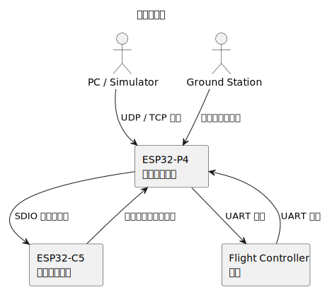

# 系统总览

适合谁看：
- 已经知道项目是双端固件，但还不清楚整体结构的人
- 想先看系统全貌，再进入模块细节的人

读完会得到什么：
- 知道系统有哪些角色
- 知道主数据流怎么走
- 知道后面该去看哪一篇架构文档

## 先从角色开始理解

这个系统里一共有五类角色：

- PC 或仿真器
- 地面站
- ESP32-P4
- ESP32-C5
- 飞控

PC、仿真器和地面站位于系统外部。它们通过网络把数据发到设备里。飞控也位于系统外部，但它连接的是 UART。P4 和 C5 位于设备内部，二者合作完成无线到串口的桥接。

先理解这些角色，再看图会更清楚。

## 主数据流是什么

最重要的数据流有两条。

第一条是“网络进入飞控”。外部设备通过 UDP 或 TCP 把数据发给 P4。P4 收到以后，经过桥接逻辑转发到 UART，最后送到飞控。

第二条是“飞控回到网络”。飞控把数据发到 UART。P4 从 UART 收到以后，再通过网络发回外部客户端。

这两条路是理解整个项目的核心。C5 并不直接做上层桥接逻辑，它主要是为 P4 提供无线能力。

## 为什么要把系统拆成两篇架构文档

P4 和 C5 的代码风格很不一样。

- P4 更像应用层项目，重点是模块协作
- C5 更像在上游 `esp-hosted` 上做定制，重点是配置、传输和限制

所以后续要分开看：

- 想理解桥接行为，看 [P4 固件架构](./p4-firmware-architecture.md)
- 想理解协处理器行为，看 [C5 固件架构](./c5-firmware-architecture.md)
- 想理解两端如何一起工作，看 [P4 与 C5 联动](./p4-c5-integration.md)
