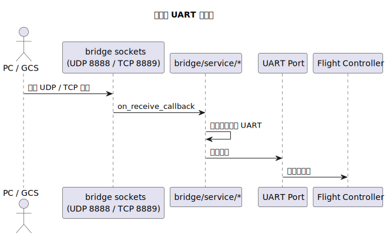
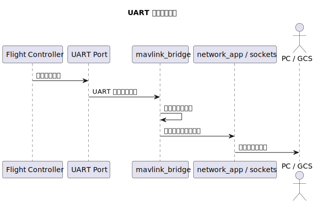

# 数据流

适合谁看：
- 想知道消息到底怎么走的人
- 准备排查“数据进来了但没出去”这类问题的人

读完会得到什么：
- 知道两条主要数据流是什么
- 知道每条路径上经过哪些模块
- 知道排查时该在哪一段截断问题

## 先理解两条主路径

系统里最重要的数据流不是很多，核心就两条。

第一条是“网络到 UART”。它描述外部设备发来的消息如何进入 P4，再送到飞控。

第二条是“UART 到网络”。它描述飞控的回传如何从串口进入 P4，再发回外部客户端。

## 网络到 UART

当外部设备发消息时，当前主链路不是先经过 `net_*` 对应的 `network/service/*`，而是直接进入桥接器内部的网络监听。P4 先在 `bridge/service/bridge_network_runtime.cpp` 里收 UDP/TCP 数据，然后桥接模块决定如何把数据继续向下送，最后由 UART 发给飞控。

先理解这个文字版顺序，再看时序图：

1. 外部设备发送网络包
2. P4 桥接器内部网络监听接收数据
3. `mavlink_bridge_net_to_all_uarts()` 决定并执行转发
4. UART 向飞控发送数据

## UART 到网络

反方向时，飞控先把数据送到串口。P4 读取串口以后，桥接模块再把数据发回网络端。

当前实现里这一步有一个需要特别注意的事实：UART 回传走的是 `bridge_tcp_broadcast()`，也就是广播给当前已连接的 TCP 客户端，并不会自动回发到 UDP 发送方。

顺序如下：

1. 飞控向 UART 发送数据
2. P4 桥接模块接收 UART 数据
3. 桥接模块把数据交给 TCP 广播逻辑
4. 已连接的 TCP 客户端收到回传

## 配置是怎么影响数据流的

运行时命令不会直接替代业务模块，但它会影响你走的是哪条路径。

比如：

- `wifi_set` 决定设备是否能连上网络
- `uart_en` 决定串口链路是否打开
- `net_type` / `net_mode` / `net_target` / `net_port` 只影响独立的 `network/service/*` 调试通道，不直接改主桥接默认监听

所以当一条路径失败时，先分清你查的是主桥接链路，还是 `net_*` 那条独立调试通路。

## 排查时怎么切数据流

最有效的方法不是同时盯着所有模块，而是把路径切成几段：

- 网络是否已经收到了数据
- 桥接模块是否已经接到数据
- UART 是否已经写出或读入
- 网络是否已经成功发回

只要在这四段里找到第一处断点，问题范围就会马上缩小。
